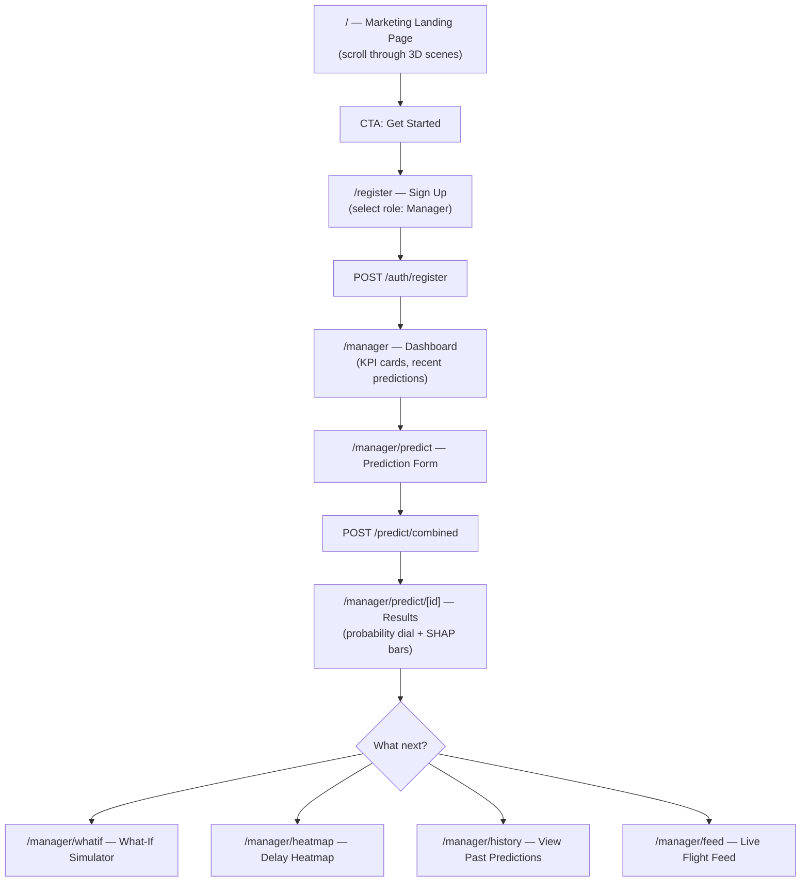
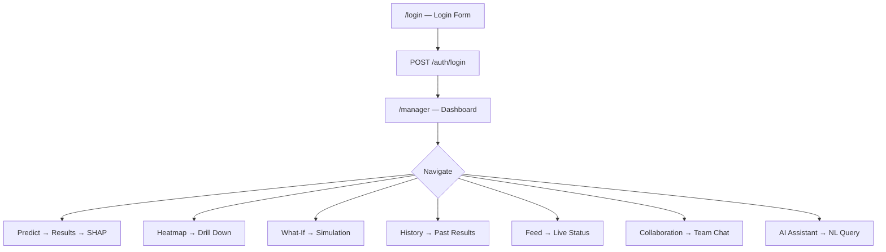
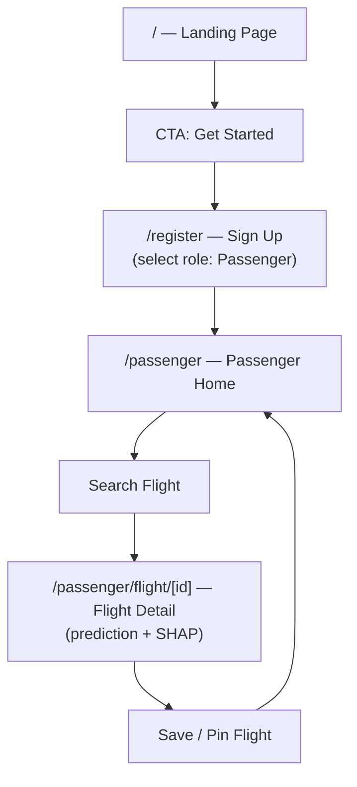
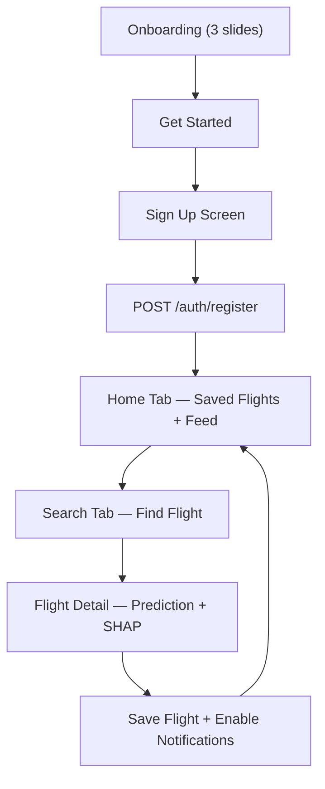
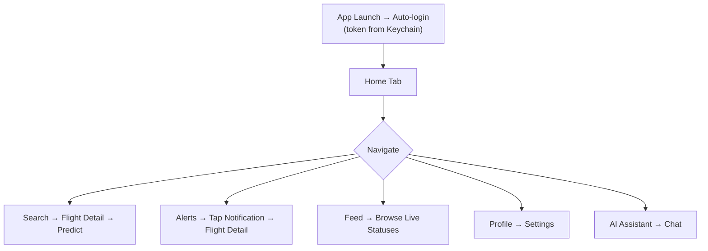
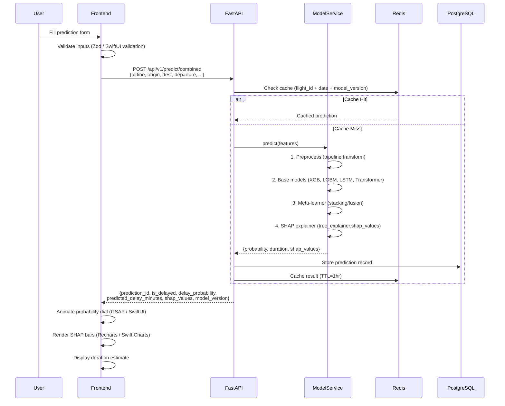
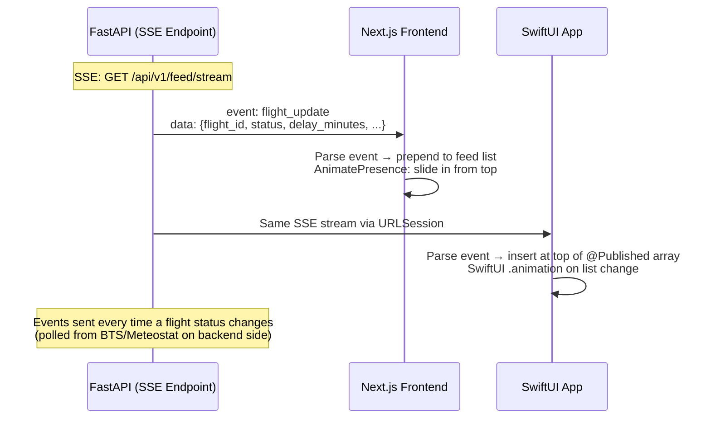
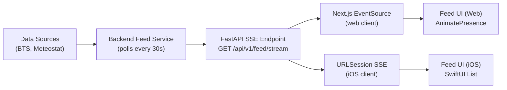

# Skylytics — Frontend Specification Document

> **Project:** Skylytics — An AI-Powered Flight Delay Prediction System  
> **Platforms:** Web (Next.js) + iOS (SwiftUI)  
> **Backend Reference:** Skylytics Analysis Report (29 API endpoints)  
> **Date:** 2026-04-09  
> **Scope:** Pages · User Flow · Data Flow · Tech Stack · Feed · Responsive Strategy · Integration

---

## Table of Contents

1. [All Pages & Screens (Web + iOS)](#1-all-pages--screens-web--ios)
2. [User Flow](#2-user-flow)
3. [Data Flow](#3-data-flow)
4. [Tech Stack — Web Frontend](#4-tech-stack--web-frontend)
5. [Tech Stack — iOS Frontend](#5-tech-stack--ios-frontend)
6. [Web Responsive Design Strategy](#6-web-responsive-design-strategy)
7. [Flight Feed (Web + iOS)](#7-flight-feed-web--ios)
8. [Single Backend — Web + iOS Integration](#8-single-backend--web--ios-integration)
9. [Feature Parity Table](#9-feature-parity-table)

---

## 1. All Pages & Screens (Web + iOS)

### 1a — Web Pages (Next.js)

---

#### Page 1: Marketing / Landing Page (Immersive Storytelling)

| Field | Detail |
|---|---|
| **Route** | `/` |
| **Purpose** | The hero page of the entire product — an immersive, scroll-driven, interactive 3D storytelling experience. Users scroll through cinematic scenes that explain what Skylytics does: a flight taking off, weather conditions forming, delay prediction visualized in real-time, SHAP explanation bars populating, and a final CTA to sign up. This is NOT a typical static landing page — it is a full WebGL/Three.js experience with custom shaders, GSAP scroll triggers, and Framer Motion transitions. |
| **Sections** | **Scene 1:** Hero — 3D airplane model on a dark runway, title "Skylytics" fades in with a glitch/reveal shader, tagline animates word-by-word. **Scene 2:** Problem — Flight delay statistics animate in (counter-up), 3D globe rotates showing delay hotspots. **Scene 3:** Solution — Hybrid ML model architecture visualized as interconnected nodes (Three.js particles), data streams flow between XGBoost, LSTM, Transformer nodes. **Scene 4:** Explainability — SHAP bar chart animates in 3D space, bars grow with stagger. **Scene 5:** Platforms — Web dashboard and iOS app mockups float in parallax. **Scene 6:** CTA — "Get Started" button with ripple shader effect → navigates to `/register`. |
| **Backend APIs** | None (static page, no API calls) |
| **Data Sent** | None |
| **Data Received** | None |
| **Key Technologies** | Three.js (3D scenes, airplane model, globe), R3F (React Three Fiber for React integration), GSAP ScrollTrigger (scroll-driven scene transitions), Custom GLSL shaders (glitch reveal, particle effects, gradient noise), Framer Motion (text animations, section transitions), Tailwind CSS (responsive fallbacks) |

---

#### Page 2: Login

| Field | Detail |
|---|---|
| **Route** | `/login` |
| **Purpose** | Authenticate existing users. Role-aware redirect after login (manager → `/manager`, passenger → `/passenger`). Dark-themed form with subtle 3D background particles (Three.js canvas behind form). |
| **Backend APIs** | `POST /api/v1/auth/login` |
| **Data Sent** | `{ email: string, password: string }` |
| **Data Received** | `{ user_id, email, role, access_token, refresh_token }` |
| **Features** | Email + password fields, "Forgot Password" link, "Don't have an account? Sign Up" link, form validation (Zod + React Hook Form), error toasts (wrong credentials), JWT tokens stored in httpOnly cookies (web) |

---

#### Page 3: Register / Sign Up

| Field | Detail |
|---|---|
| **Route** | `/register` |
| **Purpose** | Create a new account with role selection (Manager or Passenger). |
| **Backend APIs** | `POST /api/v1/auth/register` |
| **Data Sent** | `{ email, password, full_name, role: "manager" | "passenger" }` |
| **Data Received** | `{ user_id, email, role, access_token, refresh_token }` |
| **Features** | Full name, email, password, confirm password, role picker (toggle/radio), terms checkbox, redirect to appropriate dashboard on success |

---

#### Page 4: Forgot Password

| Field | Detail |
|---|---|
| **Route** | `/forgot-password` |
| **Purpose** | Initiate password reset flow. |
| **Backend APIs** | `POST /api/v1/auth/forgot-password` (to be built) |
| **Data Sent** | `{ email }` |
| **Data Received** | `{ message: "Reset link sent" }` |
| **Features** | Email input, submit button, success confirmation screen |

---

#### Page 5: Manager Dashboard (Home)

| Field | Detail |
|---|---|
| **Route** | `/manager` |
| **Purpose** | The operational command center for airline managers. Shows KPI summary, recent predictions, quick-predict widget, and flight feed preview. Sidebar navigation to all manager features. 3D ambient background (subtle particle field or radar sweep animation using Three.js). |
| **Backend APIs** | `GET /api/v1/analytics/summary`, `GET /api/v1/flights?limit=10`, `GET /api/v1/feed/latest` (SSE connection) |
| **Data Sent** | Query params: `?period=today` |
| **Data Received** | `{ total_flights, delayed_count, on_time_rate, avg_delay_minutes, top_delayed_airport }`, flight list, feed items |
| **UI Components** | 4× MetricCard (KPIs with animated counters — GSAP), Recent Predictions table, Flight Feed preview strip, Quick Predict CTA button, Sidebar nav |
| **Layout** | Sidebar (240px) + Content area. Sidebar collapses to icon rail < 1024px, becomes bottom tab bar < 768px. |

---

#### Page 6: Flight Prediction Form

| Field | Detail |
|---|---|
| **Route** | `/manager/predict` |
| **Purpose** | Input flight parameters to get a delay prediction. Form with smart dropdowns (airline, airport codes), date/time pickers, optional weather overrides. |
| **Backend APIs** | `POST /api/v1/predict/combined` |
| **Data Sent** | `{ airline, origin_airport, destination_airport, scheduled_departure, month, day_of_week, distance, weather_data?: { temp, wind_speed, precip, visibility } }` |
| **Data Received** | `{ prediction_id, is_delayed, delay_probability, predicted_delay_minutes, shap_values: [{feature, contribution}], model_version, timestamp }` |
| **Features** | Smart airport search (autocomplete from cached airport list), airline dropdown, date picker, time picker, distance auto-calculated from route, optional weather override section (expandable), "Predict" CTA button with loading state |
| **On Success** | Redirect to `/manager/predict/[prediction_id]` with the result |

---

#### Page 7: Prediction Results + SHAP Explanation

| Field | Detail |
|---|---|
| **Route** | `/manager/predict/[id]` |
| **Purpose** | Display the prediction result with full SHAP explainability. This is the most visually impactful page in the app. |
| **Backend APIs** | `GET /api/v1/shap/{prediction_id}` (if not already included in prediction response) |
| **Data Received** | Prediction result + SHAP values |
| **UI Components** | **Hero:** Delay probability percentage — massive number (Space Grotesk 700, `text-7xl`), color-coded (`green < 30%`, `amber 30-60%`, `red > 60%`), animated sweep from 0 → value (GSAP). **Confidence bar:** Horizontal gradient bar (green → amber → red), needle sweeps to probability position. **Duration estimate:** "Estimated delay: ~23 minutes" in monospace. **SHAP Panel:** "Why this prediction?" — horizontal bar chart (Recharts), top 6 features, bars grow left-to-right with stagger (Framer Motion `staggerChildren: 0.06`), positive contributions in cyan (`#00C2FF`), negative in amber (`#F59E0B`). **Flight summary card:** Route, airline, departure time, date. **Actions:** "Run What-If", "Save to History", "Share with Team". |
| **Animations** | Probability dial sweeps (GSAP timeline), SHAP bars grow in sequence (Framer Motion), confidence bar fills (CSS transition + GSAP), number counter-up effect |

---

#### Page 8: Delay Heatmap

| Field | Detail |
|---|---|
| **Route** | `/manager/heatmap` |
| **Purpose** | Full-width interactive map showing delay severity across airports. Managers can see which airports/routes are most affected. |
| **Backend APIs** | `GET /api/v1/heatmap?date=2026-04-09&group_by=airport` |
| **Data Received** | `{ data: [{ airport_code, lat, lon, avg_delay, flight_count, delay_severity }] }` |
| **UI Components** | Dark-themed map (Mapbox GL JS with dark-v11 style or Deck.gl with dark basemap), airport nodes as circles sized by `flight_count` and colored by `delay_severity` (green → amber → red gradient), hover tooltip: airport code, avg delay, # flights, click: drill down to airport-specific predictions |
| **Technologies** | Mapbox GL JS or Deck.gl (WebGL-accelerated map rendering), react-map-gl for React integration |

---

#### Page 9: What-If Simulator

| Field | Detail |
|---|---|
| **Route** | `/manager/whatif` |
| **Purpose** | Two-panel interactive simulator. Managers adjust parameters and see live prediction changes. |
| **Backend APIs** | `POST /api/v1/whatif` |
| **Data Sent** | `{ base_prediction_id, modified_features: { weather_severity, congestion_level, departure_hour, ... } }` |
| **Data Received** | Combined prediction + `{ delta_from_base: { probability_change, duration_change } }` |
| **UI Components** | **Left panel:** Sliders (weather severity 1–5, congestion level 1–5, departure hour 0–23), dropdowns (airline, origin, destination), "Reset to Original" button. **Right panel:** Live prediction output — probability number, SHAP bars, delta indicators ("▲ +12% from original"). Numbers animate counter-up/down on input change (GSAP). |
| **Interaction** | Debounced API calls on slider change (~300ms), results animate smoothly between states |

---

#### Page 10: Prediction History

| Field | Detail |
|---|---|
| **Route** | `/manager/history` |
| **Purpose** | Browse and search past predictions. Filterable table/list view. |
| **Backend APIs** | `GET /api/v1/flights?page=1&limit=20`, `GET /api/v1/flights/{id}/predictions` |
| **Data Received** | Paginated flight/prediction list |
| **UI Components** | Filter bar (date range, airport, airline, status), sortable table (columns: date, route, airline, probability, duration, status), pagination, click row → navigate to `/manager/predict/[id]` for full result |

---

#### Page 11: Flight Feed (Live)

| Field | Detail |
|---|---|
| **Route** | `/manager/feed` (also appears as a sidebar widget on dashboard) |
| **Purpose** | Real-time feed of flight statuses — which flights are on time, delayed, or cancelled. Updates continuously. |
| **Backend APIs** | `GET /api/v1/feed/stream` (SSE — Server-Sent Events) |
| **Data Received** | Streaming: `{ flight_id, airline, route, status: "on_time" | "delayed" | "cancelled", delay_minutes, timestamp }` |
| **UI Components** | Vertical scrollable feed, each item = FlightFeedCard (airline logo area, flight code, route, status pill, delay amount, timestamp). New items slide in from top with Framer Motion `AnimatePresence`. Status pills color-coded (green/amber/red). |
| **Update Mechanism** | SSE (Server-Sent Events) — See Section 7 for detail |

---

#### Page 12: Collaboration Panel

| Field | Detail |
|---|---|
| **Route** | `/manager/collaboration` |
| **Purpose** | Discussion threads per flight where managers share insights, annotations, and coordinate responses. |
| **Backend APIs** | `GET /api/v1/collaboration/messages/{flight_id}`, `POST /api/v1/collaboration/messages` |
| **Data Sent** | `{ flight_id, content, author_id }` |
| **Data Received** | `{ messages: [{ message_id, content, author, created_at }] }` |
| **UI Components** | Flight selector dropdown, message thread (chat-like bubbles), message input + send button, author avatar + name |

---

#### Page 13: AI Assistant

| Field | Detail |
|---|---|
| **Route** | `/manager/assistant` (also available as a slide-in panel from any page) |
| **Purpose** | Natural language AI chat for querying flight data, asking about predictions, or getting operational insights. |
| **Backend APIs** | `POST /api/v1/assistant/chat` (SSE stream for response) |
| **Data Sent** | `{ message, conversation_history?: [...], flight_context?: { flight_id } }` |
| **Data Received** | SSE stream of text chunks (for typewriter effect) |
| **UI Components** | Chat interface: message bubbles (user = right-aligned, assistant = left-aligned), typing indicator, markdown rendering in assistant responses, optional flight card embeds in responses |

---

#### Page 14: Manager Settings / Profile

| Field | Detail |
|---|---|
| **Route** | `/manager/settings` |
| **Purpose** | Account management, notification preferences, password change. |
| **Backend APIs** | `GET /api/v1/auth/me`, `PUT /api/v1/auth/me`, `PUT /api/v1/auth/me/password` |
| **UI Components** | Profile info form (name, email), password change form, notification preferences (toggles), danger zone (delete account) |

---

#### Page 15: Passenger Portal (Home)

| Field | Detail |
|---|---|
| **Route** | `/passenger` |
| **Purpose** | Passenger-facing home — search flights, view saved/pinned flights, flight feed preview. |
| **Backend APIs** | `GET /api/v1/flights?query=...`, `GET /api/v1/users/{id}/flights`, `GET /api/v1/feed/stream` (SSE) |
| **UI Components** | Search bar (flight number, route), saved flights list with status pills, feed preview strip, quick-predict widget |

---

#### Page 16: Passenger Flight Detail

| Field | Detail |
|---|---|
| **Route** | `/passenger/flight/[id]` |
| **Purpose** | Full flight detail with delay prediction, SHAP mini-chart, and save/unsave toggle. |
| **Backend APIs** | `GET /api/v1/flights/{id}`, `POST /api/v1/predict/combined`, `POST /api/v1/users/{id}/flights`, `DELETE /api/v1/users/{id}/flights/{flight_id}` |
| **UI Components** | Flight info card, delay probability dial (same as manager but compact), SHAP mini-chart (top 4 features), save/pin toggle button, notification opt-in toggle |

---

#### Page 17: Passenger Profile

| Field | Detail |
|---|---|
| **Route** | `/passenger/profile` |
| **Purpose** | Account settings, saved flights management, notification preferences. |
| **Backend APIs** | `GET /api/v1/auth/me`, `PUT /api/v1/auth/me` |

---

### 1b — iOS Screens (SwiftUI)

> **Key difference:** iOS does NOT have the marketing/landing page. It starts with onboarding.
> **Target users:** Passengers only (per project constraints: "iOS is passenger-facing only").

---

#### Screen 1: Onboarding (3 slides)

| Field | Detail |
|---|---|
| **Purpose** | First-time app launch walkthrough. 3 swipeable screens introducing Skylytics. |
| **Slide 1** | "Know Before You Fly" — airplane illustration + tagline |
| **Slide 2** | "AI-Powered Predictions" — prediction gauge animation |
| **Slide 3** | "Understand Why" — SHAP explanation mini-graphic |
| **Final CTA** | "Get Started" → navigates to Login/Sign Up |
| **Backend APIs** | None |
| **Technologies** | SwiftUI `TabView` with `PageTabViewStyle`, custom page indicator, `withAnimation(.spring(...))` for transitions |

---

#### Screen 2: Login

| Field | Detail |
|---|---|
| **Purpose** | Authenticate returning users. |
| **Backend APIs** | `POST /api/v1/auth/login` |
| **Data Sent** | `{ email, password }` |
| **Data Received** | `{ user_id, email, role, access_token, refresh_token }` |
| **Token Storage** | Access token → Keychain (via `KeychainAccess` library), refresh token → Keychain |

---

#### Screen 3: Sign Up

| Field | Detail |
|---|---|
| **Purpose** | Register new passenger account (role auto-set to "passenger"). |
| **Backend APIs** | `POST /api/v1/auth/register` |
| **Data Sent** | `{ email, password, full_name, role: "passenger" }` |

---

#### Screen 4: Home / Dashboard (Tab 1: 🏠)

| Field | Detail |
|---|---|
| **Purpose** | Passenger home — saved flights with live statuses, quick prediction access, feed preview. |
| **Backend APIs** | `GET /api/v1/users/{id}/flights`, `GET /api/v1/analytics/summary`, `GET /api/v1/feed/stream` (SSE) |
| **UI Components** | Saved flights carousel (horizontal scroll), KPI strip (total flights tracked, avg delay), flight feed preview (3 latest items), "Check a Flight" CTA |
| **Animations** | Card appearance: `.transition(.opacity.combined(with: .move(edge: .bottom)))`, loading: `redacted(reason: .placeholder)` skeleton |

---

#### Screen 5: Flight Search (Tab 2: 🔍)

| Field | Detail |
|---|---|
| **Purpose** | Search flights by number, route, or airline. |
| **Backend APIs** | `GET /api/v1/flights?query=...` |
| **UI Components** | Search bar with real-time suggestions, results list with FlightCard components (airline, route, status pill, probability), pull-to-refresh |

---

#### Screen 6: Flight Detail (Push from Home/Search)

| Field | Detail |
|---|---|
| **Purpose** | Full flight info with prediction result, SHAP chart, and save/pin action. |
| **Backend APIs** | `GET /api/v1/flights/{id}`, `POST /api/v1/predict/combined`, `GET /api/v1/shap/{prediction_id}`, `POST /api/v1/users/{id}/flights` |
| **UI Components** | Flight header (airline, route, times), delay probability gauge (large, animated with `withAnimation`), SHAP bar chart (Swift Charts, top 6 features), duration estimate, save/pin button with haptic feedback, notification toggle |
| **Animations** | Probability gauge sweeps (`.animation(.spring(response: 0.4, dampingFraction: 0.8))`), SHAP bars grow sequentially |

---

#### Screen 7: Prediction Form (Push or from CTA)

| Field | Detail |
|---|---|
| **Purpose** | Manual flight parameter input for custom predictions. |
| **Backend APIs** | `POST /api/v1/predict/combined` |
| **Data Sent** | Same as web prediction form |
| **UI Components** | Airline picker (SwiftUI `Picker`), airport search fields, date/time pickers (`DatePicker`), submit button |

---

#### Screen 8: Alerts / Notifications (Tab 3: 🔔)

| Field | Detail |
|---|---|
| **Purpose** | Notification history — push notification log for delay alerts on saved flights. |
| **Backend APIs** | `GET /api/v1/notifications`, `PUT /api/v1/notifications/{id}/read` |
| **UI Components** | Notification list (title, body, timestamp, read/unread indicator), swipe to mark read, tap to navigate to relevant flight |

---

#### Screen 9: Flight Feed (Tab 4: ✈️ or embedded in Home)

| Field | Detail |
|---|---|
| **Purpose** | Live feed of flight statuses — on time, delayed, cancelled. Real-time updates. |
| **Backend APIs** | `GET /api/v1/feed/stream` (SSE) |
| **UI Components** | Vertical list of `FlightFeedCard` views, status pills, timestamps, pull-to-refresh for initial load (then SSE keeps it updated) |
| **Animations** | New items insert at top with `.transition(.asymmetric(insertion: .move(edge: .top).combined(with: .opacity), removal: .opacity))` |

---

#### Screen 10: AI Assistant (Modal/Push from any screen)

| Field | Detail |
|---|---|
| **Purpose** | Chat-based AI assistant for flight queries. |
| **Backend APIs** | `POST /api/v1/assistant/chat` |
| **UI Components** | Chat bubbles, text input + send button, typing indicator, assistant avatar |

---

#### Screen 11: Profile / Settings (Tab 5: 👤)

| Field | Detail |
|---|---|
| **Purpose** | Account management, notifications, logout. |
| **Backend APIs** | `GET /api/v1/auth/me`, `PUT /api/v1/auth/me`, `POST /api/v1/notifications/register-device` |
| **UI Components** | Profile info section, notification toggle, push notification device registration, app version, logout button, dark mode lock (always on) |

---

#### Screen 12: Saved Flights (from Home or Tab)

| Field | Detail |
|---|---|
| **Purpose** | Manage pinned/saved flights with live status tracking. |
| **Backend APIs** | `GET /api/v1/users/{id}/flights`, `DELETE /api/v1/users/{id}/flights/{flight_id}` |
| **UI Components** | List of saved flights with swipe-to-delete, status pills, tap → Flight Detail |

---

### iOS Tab Bar Structure

```
┌────────────────────────────────────────────┐
│   🏠 Home  │  🔍 Search  │  🔔 Alerts  │  ✈️ Feed  │  👤 Profile  │
└────────────────────────────────────────────┘
```

---

## 2. User Flow

### 2a — Web: First-Time User (Manager)



### 2b — Web: Returning User (Manager)



### 2c — Web: First-Time Passenger



### 2d — iOS: First-Time User (Passenger)



### 2e — iOS: Returning User (Passenger)



### 2f — Admin Flow (If Applicable)

> The proposal does not explicitly define an "admin" role. However, the `GET /api/v1/admin/metrics` endpoint exists. If an admin panel is needed:

```
/admin → System Metrics Dashboard
  ├── Total requests, avg latency, error rate, cache hit rate
  ├── Active users count
  ├── Model version info
  └── Feed health check
```

This is a future consideration — not a V1 priority.

---

## 3. Data Flow

### 3a — Prediction Data Flow (User Input → API → UI)



### 3b — SHAP Explanation Rendering Pipeline

```
Backend Response:
{
  "shap_values": [
    {"feature": "Wind Speed at Origin", "contribution": 0.23},
    {"feature": "Departure Hour", "contribution": 0.18},
    {"feature": "Congestion Index", "contribution": 0.15},
    {"feature": "Historical Avg Delay", "contribution": -0.08},
    {"feature": "Airline Carrier", "contribution": -0.05},
    {"feature": "Day of Week", "contribution": 0.03}
  ],
  "base_value": 0.35
}

Web Rendering (Recharts):
1. Sort shap_values by |contribution| descending
2. Slice top 6
3. Map to horizontal BarChart component
4. Color: contribution > 0 → cyan (#00C2FF), < 0 → amber (#F59E0B)
5. Animate: Framer Motion staggerChildren=0.06, bars grow from width 0
6. Add labels: feature name (left), contribution value (right, JetBrains Mono)

iOS Rendering (Swift Charts):
1. Same sort/slice logic
2. Swift Charts BarMark with .foregroundStyle conditional color
3. Animate: withAnimation(.spring(response: 0.4, dampingFraction: 0.8))
4. Add .annotation for labels
```

### 3c — Flight Feed Real-Time Data Flow



**Why SSE over WebSocket?**

| Factor | SSE (Selected) | WebSocket |
|---|---|---|
| Directionality | Server → Client (one-way) — perfect for feeds | Bidirectional — overkill for read-only feeds |
| Complexity | Native `EventSource` API in browsers; simple URLSession in Swift | Requires socket management, heartbeats, reconnect logic |
| HTTP/2 support | Multiplexed over single connection | Separate TCP connection |
| FastAPI support | `StreamingResponse` — trivial to implement | Requires `websockets` library, more complex |
| Reconnection | Built-in auto-reconnect in `EventSource` | Manual reconnect logic needed |

---

## 4. Tech Stack — Web Frontend

### 4a — From Proposal (Baseline)

| Technology | Role | Source |
|---|---|---|
| **Next.js** | React framework with SSR, routing, API routes | Proposal Section 5.1.2 |
| **Tailwind CSS** | Utility-first CSS framework | Proposal Section 5.1.2 |
| **Recharts / Plotly** | Data visualization charts | Proposal Section 5.1.2 |

### 4b — Extended Modern Stack (User Requirements)

| Category | Library / Tool | Version | Purpose |
|---|---|---|---|
| **Core Framework** | Next.js | 16.x (already installed) | App router, SSR/SSG, API routes, file-based routing |
| **Language** | TypeScript | 5.x (already installed) | Type safety across entire frontend |
| **Styling** | Tailwind CSS | 4.x (already installed) | Responsive utility classes, dark mode, custom color system |
| | PostCSS | (already installed) | CSS processing pipeline |
| **3D / WebGL** | Three.js | latest | 3D scene rendering — airplane models, globe, particles |
| | React Three Fiber (R3F) | latest | React wrapper for Three.js — declarative 3D |
| | @react-three/drei | latest | R3F helpers — OrbitControls, Environment, Text3D, Float, etc. |
| | @react-three/postprocessing | latest | Post-processing effects — bloom, vignette, noise |
| **Custom Shaders** | GLSL (via R3F `shaderMaterial`) | — | Custom vertex/fragment shaders — glitch reveals, gradient noise, particle behavior, hover effects |
| | glslify | latest | GLSL module system for organizing shader code |
| **Animation (Scroll-Driven)** | GSAP (GreenSock) | latest | Timeline animations, ScrollTrigger for scene transitions, counter-up effects, elastic easings |
| | @gsap/react | latest | React hooks for GSAP (useGSAP) |
| | GSAP ScrollTrigger (plugin) | latest | Scroll-driven scene pinning and progress-based animation |
| | GSAP ScrollSmoother (plugin) | latest | Smooth scroll experience for the marketing page |
| **Animation (Component)** | Framer Motion | latest | Page transitions, component mount/unmount animations, stagger effects, AnimatePresence, layout animations |
| **Data Visualization** | Recharts | latest | SHAP bar charts, prediction history line charts, KPI sparklines |
| | Plotly.js (react-plotly.js) | latest | Interactive heatmaps, complex multi-axis charts |
| **Maps** | Mapbox GL JS | latest | Dark-themed airport delay heatmap |
| | react-map-gl | latest | React wrapper for Mapbox GL |
| | Deck.gl (optional) | latest | WebGL-accelerated large-scale map visualizations |
| **Forms** | React Hook Form | latest | Performant form handling with minimal re-renders |
| | Zod | latest | Schema validation for form inputs |
| **State Management** | Zustand | latest | Global state (auth, user, active prediction) — minimal boilerplate |
| | TanStack Query (React Query) | latest | Server state management — caching, refetching, optimistic updates |
| **Networking** | Axios | latest | HTTP client for API calls (interceptors for JWT refresh) |
| | EventSource (native) | — | SSE client for flight feed |
| **Auth** | next-auth or custom JWT | — | JWT token management, httpOnly cookies, middleware-based route protection |
| **Fonts** | `next/font` | — | Self-hosted: Space Grotesk (headers), Inter (body), JetBrains Mono (data) |
| **Icons** | Lucide React | latest | Consistent icon system (open source, tree-shakeable) |
| **Notifications** | Sonner (or react-hot-toast) | latest | Toast notifications for success/error states |
| **Date/Time** | date-fns | latest | Lightweight date formatting and manipulation |
| **Markdown (AI Chat)** | react-markdown | latest | Render AI assistant responses with formatting |
| **SEO** | Next.js Metadata API | built-in | Title tags, meta descriptions, Open Graph tags |
| **Linting** | ESLint + Prettier | (already configured) | Code quality and formatting |
| **Testing** | Playwright | latest | E2E browser testing |
| | Vitest | latest | Unit testing (faster than Jest for Vite-compatible setups) |

### 4c — Marketing Page Technology Architecture

```
Marketing Landing Page ("/")
│
├── Scene Manager (GSAP ScrollTrigger)
│   ├── Scroll progress → scene index mapping
│   ├── Pin sections during scroll
│   └── Smooth scroll (ScrollSmoother)
│
├── 3D Canvas (React Three Fiber)
│   ├── Scene 1: Airplane on Runway
│   │   ├── GLTF model (low-poly airplane)
│   │   ├── Custom PBR shader (metallic fuselage)
│   │   └── Fog + volumetric lighting
│   │
│   ├── Scene 2: Global Delay Visualization
│   │   ├── 3D Globe (Three.js SphereGeometry)
│   │   ├── Custom particle shader (delay hotspots)
│   │   └── Counter-up statistics (GSAP)
│   │
│   ├── Scene 3: ML Pipeline Visualization
│   │   ├── Node graph (instanced meshes)
│   │   ├── Data stream particles (custom shader)
│   │   └── XGBoost → LSTM → Transformer flow
│   │
│   ├── Scene 4: SHAP Explanation
│   │   ├── 3D bar chart (BoxGeometry instances)
│   │   ├── Bars grow with scroll progress
│   │   └── Feature labels (Text component)
│   │
│   └── Scene 5: Platform Showcase
│       ├── Floating device mockups
│       ├── Parallax depth layers
│       └── Final CTA with ripple shader
│
└── HTML Overlay (Framer Motion)
    ├── Section titles (AnimatePresence)
    ├── Body text (stagger reveal)
    └── CTA buttons (scale + glow on hover)
```

---

## 5. Tech Stack — iOS Frontend

### 5a — From Proposal (Baseline)

| Technology | Role | Source |
|---|---|---|
| **SwiftUI** | Native iOS UI framework | Proposal Section 5.1.2 |
| **Apple Developer Account** | App distribution | Proposal Section 5.1.2 |

### 5b — Complete iOS Library Stack

| Category | Library / Framework | Purpose |
|---|---|---|
| **UI Framework** | SwiftUI | Primary UI — declarative, state-driven views |
| | UIKit (bridged) | Only for components not yet available in SwiftUI (e.g., some advanced text editing) |
| **Architecture** | MVVM (Model-View-ViewModel) | Architecture pattern — ViewModels hold state, Views observe via `@Published` |
| | Combine | Reactive data binding between ViewModels and Views |
| **Networking** | URLSession (native) | HTTP requests to FastAPI backend — no third-party dependency needed |
| | Alamofire (optional) | Advanced HTTP features — interceptors, retry, multipart upload (if needed) |
| | EventSource (Swift SSE) | SSE client for flight feed streaming — use `LDSwiftEventSource` (LaunchDarkly) or custom URLSession SSE parser |
| **Authentication** | KeychainAccess (by kishikawa) | Secure storage for JWT access + refresh tokens in iOS Keychain |
| | JWT decode (JWTDecode.swift) | Decode JWT payloads to check expiration without server call |
| **Charts / Visualization** | Swift Charts (Apple native) | SHAP bar charts, delay probability gauges, history line charts — native, performant, dark-mode-ready |
| **Animations** | SwiftUI Animations (native) | `.spring()`, `.easeInOut()`, `withAnimation {}` — for all state transitions |
| | Lottie (lottie-ios) | ❌ **NOT USED** — per frontend design rules: "No Lottie animations — they are a maintenance liability and often look generic" |
| | Custom SwiftUI Animations | Gauge sweep, bar growth, card transitions — all hand-coded |
| **3D / Modern UI** | SceneKit (Apple native) | Optional: subtle 3D elements (e.g., rotating airplane model on home screen) |
| | RealityKit (optional) | Advanced 3D if needed — AR-capable but usable for standard 3D |
| | Metal Shaders (optional) | Custom GPU shaders for premium visual effects (e.g., gradient noise backgrounds) |
| **Navigation** | NavigationStack (SwiftUI) | Programmatic navigation with path-based routing (iOS 16+) |
| **Image Loading** | Kingfisher or SDWebImage | Async image loading + caching (for airline logos, user avatars) |
| **Push Notifications** | UserNotifications (Apple native) | Local + remote notification handling |
| | APNs (Apple Push Notification service) | Backend sends delay alerts via APNs → device |
| **Loading States** | `.redacted(reason: .placeholder)` | Skeleton loading — per design rules: hand-written, on-brand |
| **Haptics** | UIImpactFeedbackGenerator | Haptic feedback on save/pin actions, predictions |
| **Persistence** | UserDefaults | Non-sensitive app preferences (notification settings, onboarding complete flag) |
| | Core Data or SwiftData | Offline cache for saved flights (optional, for offline-first experience) |
| **Accessibility** | SwiftUI accessibility modifiers | VoiceOver labels, dynamic type support, color contrast compliance |
| **Testing** | XCTest | Unit tests for ViewModels |
| | XCUITest | UI integration tests |
| | Swift Snapshot Testing (pointfree) | Snapshot-based UI regression tests |
| **Distribution** | Apple Developer Account ($99/yr) | TestFlight (beta) + App Store (production) |
| **Min Target** | iOS 17.0+ | Required for NavigationStack, Swift Charts, and modern SwiftUI features |

### 5c — iOS Color System (Matching Web)

```swift
// Colors.xcassets or Color extension
extension Color {
    static let skyBg         = Color(hex: "#0A0F1E")   // --color-sky-950
    static let skyCard       = Color(hex: "#0D1530")   // --color-sky-900
    static let skyElevated   = Color(hex: "#112040")   // --color-sky-800
    static let skyBorder     = Color(hex: "#1A3260")   // --color-sky-700
    static let skyAccent     = Color(hex: "#00C2FF")   // --color-accent
    static let skyAccentDim  = Color(hex: "#0099CC")   // --color-accent-dim
    static let skyWarning    = Color(hex: "#F59E0B")   // --color-warning
    static let skyDanger     = Color(hex: "#EF4444")   // --color-danger
    static let skySuccess    = Color(hex: "#10B981")   // --color-success
    static let textPrimary   = Color(hex: "#F0F4FF")   // --color-text-primary
    static let textSecondary = Color(hex: "#8BA3C7")   // --color-text-secondary
    static let textDim       = Color(hex: "#4A6080")   // --color-text-dim
}
```

### 5d — iOS Typography (Matching Web)

```swift
// Typography extension
extension Font {
    static let heroNumber    = Font.system(size: 56, weight: .bold, design: .default)       // Maps to Space Grotesk 700
    static let sectionTitle  = Font.system(size: 22, weight: .semibold, design: .default)   // Maps to Space Grotesk 600
    static let bodyText      = Font.system(size: 16, weight: .regular, design: .default)    // Maps to Inter 400
    static let caption       = Font.system(size: 13, weight: .medium, design: .default)     // Maps to Inter 500
    static let dataValue     = Font.system(size: 18, weight: .medium, design: .monospaced)  // Maps to JetBrains Mono
}
```

---

## 6. Web Responsive Design Strategy

### 6a — Design Philosophy

> **Principle:** The web mobile view (< 768px) must be visually indistinguishable from the iOS app. A user switching between their iPhone (iOS app) and their phone's browser (web mobile) should feel zero disorientation.

### 6b — Tailwind CSS Breakpoint System

| Breakpoint | Tailwind Prefix | Screen Size | Target Device | Layout |
|---|---|---|---|---|
| Default (mobile-first) | None | < 640px | iPhone, small Android | Bottom tab bar, full-width cards, single column |
| `sm:` | 640px+ | Small tablets, large phones | Similar to iOS but slightly wider cards |
| `md:` | 768px+ | iPad, tablets | Sidebar as icon rail, 2-column grid for cards |
| `lg:` | 1024px+ | Laptop | Full sidebar (240px), 2–3 column grid |
| `xl:` | 1280px+ | Desktop monitor | Full sidebar, 3-column grid, max-w-7xl content |
| `2xl:` | 1536px+ | Widescreen | Same as xl with more breathing room |

### 6c — Layout Adaptation

```
DESKTOP (≥ 1024px)                    TABLET (768–1024px)
┌──────┬──────────────────┐          ┌───┬───────────────────┐
│      │  Content Area    │          │ ≡ │  Content Area     │
│ Side │  ┌────┬────┬────┐│          │   │  ┌────┬────┐     │
│ bar  │  │Card│Card│Card││          │   │  │Card│Card│     │
│      │  ├────┴────┴────┤│          │   │  ├────┴────┤     │
│ 240  │  │   Main Panel  ││          │60 │  │ Main Panel│     │
│  px  │  └──────────────┘│          │px │  └──────────┘     │
└──────┴──────────────────┘          └───┴───────────────────┘

MOBILE (< 768px) — Mirrors iOS Layout
┌─────────────────────┐
│  Header (Title)     │
├─────────────────────┤
│                     │
│  Full-width Card    │
│                     │
├─────────────────────┤
│  Full-width Card    │
├─────────────────────┤
│  Main Panel         │
│  (full width)       │
├─────────────────────┤
│ 🏠│🔍│🔔│✈️│👤 │ ← Tab Bar (matches iOS)
└─────────────────────┘
```

### 6d — Component-Level Responsive Rules

| Component | Desktop | Tablet | Mobile (mirrors iOS) |
|---|---|---|---|
| **Navigation** | Full sidebar (240px) with labels | Icon rail (60px) | Bottom tab bar (5 tabs) — identical to iOS |
| **Metric Cards** | 4 in a row | 2 per row | 2 per row (scrollable) |
| **Prediction Form** | 2-column layout | 2-column | Single column stack |
| **SHAP Chart** | Full width with labels | Full width | Compact bars, smaller labels |
| **Heatmap** | Full width map | Full width | Full width, simplified tooltips |
| **What-If Simulator** | Side-by-side panels | Stacked panels | Stacked panels |
| **Flight Feed** | Sidebar widget or dedicated page | Dedicated page | Dedicated tab |
| **AI Assistant** | Slide-in panel from right (320px) | Full-screen modal | Full-screen modal |

### 6e — Tailwind Implementation Example

```tsx
// Manager Dashboard Layout
<div className="flex min-h-screen bg-[#0A0F1E]">
  {/* Sidebar — hidden on mobile, icon rail on tablet, full on desktop */}
  <aside className="hidden md:flex md:w-[60px] lg:w-[240px] flex-col border-r border-[#1A3260]">
    {/* Nav items */}
  </aside>

  {/* Main Content */}
  <main className="flex-1 px-4 md:px-6 pb-20 md:pb-6">
    {/* KPI Cards — 2 cols on mobile, 4 cols on desktop */}
    <div className="grid grid-cols-2 lg:grid-cols-4 gap-4">
      <MetricCard />
      <MetricCard />
      <MetricCard />
      <MetricCard />
    </div>
  </main>

  {/* Bottom Tab Bar — visible on mobile only */}
  <nav className="fixed bottom-0 left-0 right-0 md:hidden bg-[#0D1530] border-t border-[#1A3260] flex justify-around py-2">
    <TabItem icon={Home} label="Home" />
    <TabItem icon={Search} label="Search" />
    <TabItem icon={Bell} label="Alerts" />
    <TabItem icon={Plane} label="Feed" />
    <TabItem icon={User} label="Profile" />
  </nav>
</div>
```

---

## 7. Flight Feed (Web + iOS)

### 7a — Architecture



### 7b — Backend Implementation

```python
# FastAPI SSE endpoint
from fastapi.responses import StreamingResponse
from asyncio import sleep

@app.get("/api/v1/feed/stream")
async def feed_stream():
    async def event_generator():
        while True:
            # Poll for new flight status updates from DB
            updates = await get_latest_flight_updates()
            for update in updates:
                yield f"event: flight_update\ndata: {json.dumps(update)}\n\n"
            await sleep(5)  # check every 5 seconds

    return StreamingResponse(
        event_generator(),
        media_type="text/event-stream",
        headers={"Cache-Control": "no-cache", "Connection": "keep-alive"}
    )
```

### 7c — Web Client (Next.js)

```tsx
// useFeed.ts — custom hook
import { useEffect, useState } from 'react'

interface FeedItem {
  flight_id: string
  airline: string
  route: string
  status: 'on_time' | 'delayed' | 'cancelled'
  delay_minutes: number
  timestamp: string
}

export function useFeed() {
  const [items, setItems] = useState<FeedItem[]>([])

  useEffect(() => {
    const source = new EventSource('/api/v1/feed/stream')
    
    source.addEventListener('flight_update', (e) => {
      const data: FeedItem = JSON.parse(e.data)
      setItems(prev => [data, ...prev].slice(0, 100)) // keep latest 100
    })

    source.onerror = () => {
      source.close()
      // Auto-reconnect after 3s
      setTimeout(() => { /* reconnect logic */ }, 3000)
    }

    return () => source.close()
  }, [])

  return items
}
```

### 7d — iOS Client (SwiftUI)

```swift
// FeedService.swift
import Foundation
import Combine

class FeedService: ObservableObject {
    @Published var items: [FeedItem] = []
    private var task: URLSessionDataTask?

    func connect() {
        guard let url = URL(string: "\(baseURL)/api/v1/feed/stream") else { return }
        var request = URLRequest(url: url)
        request.setValue("text/event-stream", forHTTPHeaderField: "Accept")
        request.setValue("Bearer \(token)", forHTTPHeaderField: "Authorization")

        // Use URLSession with delegate for streaming
        let session = URLSession(configuration: .default, delegate: self, delegateQueue: nil)
        task = session.dataTask(with: request)
        task?.resume()
    }

    // Parse SSE data in URLSessionDataDelegate methods
    // Append to @Published items array → SwiftUI auto-updates
}
```

### 7e — Feed Card Design

```
Web (Framer Motion):                    iOS (SwiftUI):
┌──────────────────────────┐           ┌──────────────────────────┐
│ ✈️ AA 1234    JFK → LAX  │           │ ✈️ AA 1234    JFK → LAX  │
│ ● On Time     12:45 PM   │           │ ● On Time     12:45 PM   │
└──────────────────────────┘           └──────────────────────────┘
│ ▲ UA 789    ORD → SFO    │           │ ▲ UA 789    ORD → SFO    │
│ ▲ Minor Delay  +18 min   │           │ ▲ Minor Delay  +18 min   │
└──────────────────────────┘           └──────────────────────────┘

New items: AnimatePresence              New items: .transition(
  slide in from top,                      .asymmetric(
  opacity fade in                           insertion: .move(edge: .top)
                                              .combined(with: .opacity),
                                            removal: .opacity
                                          )
                                        )
```

### 7f — Feed Update Mechanism Comparison

| Mechanism | Selected? | Justification |
|---|---|---|
| **SSE (Server-Sent Events)** | ✅ **Yes** | Unidirectional (server→client), auto-reconnect, lightweight, perfect for feeds, native browser API (`EventSource`), FastAPI supports via `StreamingResponse` |
| WebSocket | ❌ No | Overkill — bidirectional not needed for read-only feeds |
| Polling (setInterval) | ❌ No | Wasteful — constant HTTP requests even when no new data |
| Long Polling | ❌ No | More complex than SSE with no advantage |

---

## 8. Single Backend — Web + iOS Integration

### 8a — Architecture Confirmation

```
                    ┌──────────────────────────┐
                    │                          │
┌──────────┐  HTTPS │    FastAPI Backend        │
│ Next.js  │◀──────▶│    (Single Instance)      │
│ Web App  │  REST  │                          │
└──────────┘  + SSE │  ┌───────────────────┐   │
                    │  │  Model Service     │   │
┌──────────┐  HTTPS │  │  (loaded once)     │   │
│ SwiftUI  │◀──────▶│  ├───────────────────┤   │
│ iOS App  │  REST  │  │  PostgreSQL        │   │
└──────────┘  + SSE │  ├───────────────────┤   │
                    │  │  Redis Cache       │   │
                    │  └───────────────────┘   │
                    └──────────────────────────┘
```

**Yes — a single FastAPI backend serves both platforms simultaneously.** Both consume identical REST JSON endpoints. There are no platform-specific API endpoints.

### 8b — Integration Concerns & Solutions

#### CORS (Cross-Origin Resource Sharing)

```python
# FastAPI CORS configuration
app.add_middleware(
    CORSMiddleware,
    allow_origins=[
        "http://localhost:3000",        # Next.js dev
        "https://skylytics.vercel.app", # Next.js production
        # iOS does NOT need CORS — native apps make direct requests
    ],
    allow_credentials=True,
    allow_methods=["*"],
    allow_headers=["*"],
)
```

| Platform | CORS Needed? | Reason |
|---|---|---|
| Web (Next.js) | ✅ Yes | Browser enforces same-origin policy — Next.js on port 3000 calls FastAPI on port 8000 |
| iOS (SwiftUI) | ❌ No | Native apps bypass CORS entirely — `URLSession` makes direct HTTP requests |

#### JWT Authentication (Both Platforms)

```
Authentication Flow (identical for both):

1. POST /auth/login → {access_token, refresh_token}
2. All subsequent requests: Authorization: Bearer <access_token>
3. When access_token expires (15 min):
   POST /auth/refresh → {new_access_token, new_refresh_token}
```

| Concern | Web (Next.js) | iOS (SwiftUI) |
|---|---|---|
| **Token storage** | httpOnly secure cookies (XSS-safe) OR `localStorage` with CSRF protection | iOS Keychain (`KeychainAccess` library) — hardware-encrypted |
| **Token refresh** | Axios interceptor — auto-refreshes on 401 response | URLSession wrapper — checks expiration before request, refreshes proactively |
| **Token in request** | `Authorization: Bearer <token>` header via Axios interceptor | `Authorization: Bearer <token>` header via URLSession `setValue` |
| **Logout** | Clear cookies / localStorage + `POST /auth/logout` | Clear Keychain + `POST /auth/logout` |

#### Platform-Specific Headers

```python
# Optional: Backend can detect platform via User-Agent or custom header
# This is NOT required but useful for analytics

# Web requests include:
#   User-Agent: Mozilla/5.0 ... (browser default)
#   X-Platform: web (optional custom header)

# iOS requests include:
#   User-Agent: Skylytics-iOS/1.0 CFNetwork/...
#   X-Platform: ios (optional custom header)
```

| Header | Web | iOS | Purpose |
|---|---|---|---|
| `Authorization` | `Bearer <token>` | `Bearer <token>` | JWT auth (identical) |
| `Content-Type` | `application/json` | `application/json` | Request body format (identical) |
| `Accept` | `application/json` | `application/json` | Response format (identical) |
| `X-Platform` (optional) | `web` | `ios` | Analytics — track requests by platform |
| `X-App-Version` (optional) | — | `1.0.0` | iOS app version tracking |

#### Response Format

**Both platforms receive identical JSON responses.** There are NO platform-specific response transformations.

```json
// Example: POST /api/v1/predict/combined
// SAME response for web AND iOS:
{
  "prediction_id": "pred_abc123",
  "is_delayed": true,
  "delay_probability": 0.73,
  "predicted_delay_minutes": 23.4,
  "shap_values": [
    {"feature": "Wind Speed at Origin", "contribution": 0.23},
    {"feature": "Departure Hour", "contribution": 0.18}
  ],
  "model_version": "v1.0.0",
  "timestamp": "2026-04-09T14:30:00Z"
}
```

### 8c — Potential Integration Issues & Mitigations

| Issue | Risk | Mitigation |
|---|---|---|
| CORS blocking web requests | Medium | Configure CORS properly in FastAPI — whitelist Vercel domain + localhost |
| iOS ATS (App Transport Security) | Low | FastAPI must serve over HTTPS in production (AWS EC2 + TLS cert) — ATS blocks plain HTTP by default |
| Token expiration race conditions | Medium | Web: Axios interceptor queue for concurrent requests. iOS: Proactive refresh before expiration |
| SSE connection drops | Medium | Web: `EventSource` auto-reconnects. iOS: Implement reconnect timer (5s backoff) |
| Large SHAP payloads on slow iOS network | Low | API returns top-6 SHAP values only (not full feature set), gzip compression enabled |
| Date/timezone parsing | Medium | Backend always returns UTC ISO8601 strings. Both platforms convert to local time at render |

---

## 9. Feature Parity Table

| # | Feature | Web (Next.js) | iOS (SwiftUI) | Notes |
|---|---|---|---|---|
| 1 | Marketing / Landing Page (3D storytelling) | ✅ Web-Only | ❌ | iOS starts at onboarding — no marketing page |
| 2 | Onboarding Walkthrough | ❌ | ✅ iOS-Only | 3-slide SwiftUI TabView walkthrough |
| 3 | Login / Register | ✅ | ✅ | Identical functionality, platform-native UI |
| 4 | Forgot Password | ✅ | ✅ | Both platforms |
| 5 | Manager Dashboard | ✅ | ❌ | iOS is passenger-only (per proposal constraints) |
| 6 | Passenger Home / Dashboard | ✅ | ✅ | Identical data, platform-native layout |
| 7 | Flight Search | ✅ | ✅ | Both platforms |
| 8 | Delay Prediction Form | ✅ | ✅ | Identical API call, native form controls |
| 9 | Prediction Results + SHAP | ✅ | ✅ | Web: Recharts, iOS: Swift Charts — same data |
| 10 | Delay Heatmap (Map) | ✅ Web-Only | ❌ | Complex map — web only for V1 |
| 11 | What-If Simulator | ✅ Web-Only | ❌ | Complex two-panel UI — web only for V1 |
| 12 | Prediction History | ✅ | ✅ | Both platforms |
| 13 | Flight Feed (Live SSE) | ✅ | ✅ | SSE on both, identical data |
| 14 | Saved / Pinned Flights | ✅ | ✅ | Both platforms |
| 15 | Push Notifications | ❌ | ✅ iOS-Only | APNs push for delay alerts — web could add browser notifications later |
| 16 | AI Assistant (Chat) | ✅ | ✅ | SSE streaming on both |
| 17 | Collaboration / Team Messaging | ✅ Web-Only | ❌ | Manager-only feature (iOS = passenger) |
| 18 | Profile / Settings | ✅ | ✅ | Both platforms |
| 19 | Dark Mode | ✅ Always-On | ✅ Always-On | Dark-mode only for V1 |
| 20 | 3D Visual Effects | ✅ Three.js + WebGL | ⚠️ Limited (SceneKit) | Web has full 3D, iOS has subtle 3D accents |
| 21 | Scroll Animations | ✅ GSAP + Framer Motion | ✅ SwiftUI Animations | Platform-native animation systems |
| 22 | Responsive (Mobile View = iOS) | ✅ Tailwind | N/A | Web mobile view mirrors iOS layout |
| 23 | Haptic Feedback | ❌ | ✅ iOS-Only | UIImpactFeedbackGenerator on key actions |
| 24 | Offline Support | ❌ | ⚠️ Partial (Core Data cache) | iOS can cache saved flights for offline viewing |
| 25 | Admin Metrics Panel | ✅ Web-Only | ❌ | Admin endpoint — web only |

### Summary Counts

| | Web | iOS | Shared |
|---|---|---|---|
| **Total Features** | 22 | 18 | 15 |
| **Platform-Exclusive** | 7 (marketing page, heatmap, what-if, collaboration, admin, 3D effects, responsive) | 3 (onboarding, push notifications, haptics) | — |

---

## Appendix A: Full File/Folder Structure (Web Frontend)

```
web_frontend/skylytics-frontend/
├── app/
│   ├── layout.tsx                    ← Root layout (fonts, metadata, providers)
│   ├── page.tsx                      ← "/" Marketing landing page
│   ├── globals.css                   ← Tailwind base + custom CSS variables
│   ├── login/
│   │   └── page.tsx                  ← Login form
│   ├── register/
│   │   └── page.tsx                  ← Sign up form
│   ├── forgot-password/
│   │   └── page.tsx                  ← Password reset
│   ├── manager/
│   │   ├── layout.tsx                ← Manager layout (sidebar + content area)
│   │   ├── page.tsx                  ← Manager dashboard
│   │   ├── predict/
│   │   │   ├── page.tsx              ← Prediction form
│   │   │   └── [id]/
│   │   │       └── page.tsx          ← Prediction result + SHAP
│   │   ├── heatmap/
│   │   │   └── page.tsx              ← Delay heatmap
│   │   ├── whatif/
│   │   │   └── page.tsx              ← What-if simulator
│   │   ├── history/
│   │   │   └── page.tsx              ← Prediction history
│   │   ├── feed/
│   │   │   └── page.tsx              ← Live flight feed
│   │   ├── collaboration/
│   │   │   └── page.tsx              ← Team messaging
│   │   ├── assistant/
│   │   │   └── page.tsx              ← AI assistant
│   │   └── settings/
│   │       └── page.tsx              ← Manager settings
│   ├── passenger/
│   │   ├── layout.tsx                ← Passenger layout (header + tab bar on mobile)
│   │   ├── page.tsx                  ← Passenger home
│   │   ├── flight/
│   │   │   └── [id]/
│   │   │       └── page.tsx          ← Flight detail + prediction
│   │   └── profile/
│   │       └── page.tsx              ← Passenger profile
│   └── admin/
│       └── page.tsx                  ← Admin metrics (optional)
├── components/
│   ├── layout/
│   │   ├── Navbar.tsx                ← Top navigation bar
│   │   ├── Sidebar.tsx               ← Manager sidebar navigation
│   │   ├── TabBar.tsx                ← Mobile bottom tab bar
│   │   └── PageShell.tsx             ← Content wrapper
│   ├── prediction/
│   │   ├── PredictionForm.tsx        ← Flight parameter inputs
│   │   ├── ProbabilityDial.tsx       ← Animated probability display
│   │   ├── ShapBarChart.tsx          ← SHAP feature contribution chart
│   │   └── DurationEstimate.tsx      ← Delay minutes display
│   ├── feed/
│   │   ├── FlightFeedCard.tsx        ← Individual feed item
│   │   └── FeedStream.tsx            ← SSE-connected feed list
│   ├── heatmap/
│   │   └── HeatmapView.tsx           ← Mapbox/Deck.gl map
│   ├── whatif/
│   │   ├── WhatIfControls.tsx        ← Input sliders/dropdowns
│   │   └── WhatIfResult.tsx          ← Live prediction output
│   ├── assistant/
│   │   └── ChatInterface.tsx         ← AI chat UI
│   ├── collaboration/
│   │   └── MessageThread.tsx         ← Discussion thread
│   ├── shared/
│   │   ├── MetricCard.tsx            ← KPI dashboard card
│   │   ├── FlightCard.tsx            ← Compact flight info card
│   │   ├── StatusPill.tsx            ← On-time / delayed / cancelled indicator
│   │   ├── SkeletonCard.tsx          ← Loading placeholder
│   │   └── NotificationToast.tsx     ← Toast notification
│   └── marketing/
│       ├── HeroScene.tsx             ← Three.js hero (airplane + runway)
│       ├── GlobeScene.tsx            ← 3D globe delay visualization
│       ├── PipelineScene.tsx         ← ML architecture node graph
│       ├── ShapScene.tsx             ← 3D SHAP bar chart
│       └── PlatformScene.tsx         ← Device mockup showcase
├── hooks/
│   ├── useAuth.ts                    ← JWT auth state management
│   ├── usePrediction.ts             ← Prediction API calls
│   ├── useFeed.ts                   ← SSE feed connection
│   ├── useShap.ts                   ← SHAP data fetching
│   └── useWhatIf.ts                 ← What-if simulation debounce
├── lib/
│   ├── api.ts                       ← Axios instance + interceptors
│   ├── auth.ts                      ← Token management helpers
│   └── constants.ts                 ← API base URL, feature names, etc.
├── shaders/
│   ├── glitch.frag                  ← GLSL: glitch reveal effect
│   ├── particles.vert               ← GLSL: particle vertex shader
│   ├── gradient-noise.frag          ← GLSL: gradient noise background
│   └── ripple.frag                  ← GLSL: button ripple effect
├── stores/
│   └── useStore.ts                  ← Zustand global state
├── types/
│   └── index.ts                     ← TypeScript types/interfaces
├── public/
│   ├── models/                      ← GLTF 3D models (airplane, globe)
│   └── fonts/                       ← Self-hosted web fonts
├── next.config.ts
├── tailwind.config.ts
├── tsconfig.json
└── package.json
```

---

## Appendix B: Full File/Folder Structure (iOS Frontend)

```
ios_frontend/Skylytics/
├── SkylyticsApp.swift                ← App entry point, WindowGroup
├── ContentView.swift                 ← Root view — onboarding check → main tabs or onboarding
├── Info.plist                        ← App config (ATS, push notification entitlements)
│
├── Models/
│   ├── User.swift                    ← User model (Codable)
│   ├── Flight.swift                  ← Flight model
│   ├── Prediction.swift              ← Prediction result model
│   ├── ShapValue.swift               ← SHAP feature contribution
│   ├── FeedItem.swift                ← Feed item model
│   └── Notification.swift            ← Notification model
│
├── ViewModels/
│   ├── AuthViewModel.swift           ← Login/register/logout state
│   ├── HomeViewModel.swift           ← Saved flights, KPIs
│   ├── SearchViewModel.swift         ← Flight search state
│   ├── PredictionViewModel.swift     ← Prediction form + result state
│   ├── FeedViewModel.swift           ← SSE feed connection + items
│   ├── NotificationViewModel.swift   ← Notification list state
│   ├── AssistantViewModel.swift      ← AI chat state
│   └── ProfileViewModel.swift        ← Profile management state
│
├── Views/
│   ├── Onboarding/
│   │   └── OnboardingView.swift      ← 3-slide walkthrough
│   ├── Auth/
│   │   ├── LoginView.swift
│   │   └── SignUpView.swift
│   ├── Home/
│   │   └── HomeView.swift            ← Tab 1: saved flights + feed preview
│   ├── Search/
│   │   ├── SearchView.swift          ← Tab 2: flight search
│   │   └── SearchResultsView.swift
│   ├── Flight/
│   │   ├── FlightDetailView.swift    ← Full flight detail + prediction
│   │   └── PredictionFormView.swift  ← Manual prediction input
│   ├── Feed/
│   │   └── FeedView.swift            ← Tab 4: live feed
│   ├── Alerts/
│   │   └── AlertsView.swift          ← Tab 3: notification history
│   ├── Assistant/
│   │   └── AssistantView.swift       ← AI chat screen
│   ├── Profile/
│   │   └── ProfileView.swift         ← Tab 5: settings
│   └── Shared/
│       ├── FlightCard.swift          ← Reusable flight card
│       ├── StatusPill.swift          ← Status indicator (on-time/delayed)
│       ├── ProbabilityGauge.swift    ← Animated probability display
│       ├── ShapChart.swift           ← Swift Charts SHAP visualization
│       ├── MetricCard.swift          ← KPI card
│       ├── FeedItemCard.swift        ← Feed entry card
│       └── SkeletonCard.swift        ← Loading placeholder
│
├── Services/
│   ├── APIService.swift              ← URLSession HTTP client + JWT interceptor
│   ├── AuthService.swift             ← Token management (Keychain)
│   ├── FeedService.swift             ← SSE connection management
│   ├── NotificationService.swift     ← APNs registration + handling
│   └── PredictionService.swift       ← Prediction API calls
│
├── Utilities/
│   ├── Color+Extensions.swift        ← Custom color palette
│   ├── Font+Extensions.swift         ← Custom typography
│   ├── KeychainHelper.swift          ← Keychain access wrapper
│   └── DateFormatter+Extensions.swift
│
├── Assets.xcassets/
│   ├── Colors/                       ← Color assets matching web palette
│   ├── Images/                       ← App icon, onboarding illustrations
│   └── AppIcon.appiconset/
│
└── Tests/
    ├── SkylyticsTests/               ← Unit tests (XCTest)
    └── SkylyticsUITests/             ← UI tests (XCUITest)
```

---

## Appendix C: Dependency Installation Commands

### Web Frontend

```bash
# Navigate to web frontend
cd web_frontend/skylytics-frontend

# Core dependencies (already installed)
# next, react, react-dom, tailwindcss

# 3D / WebGL
npm install three @react-three/fiber @react-three/drei @react-three/postprocessing

# Shaders
npm install glslify raw-loader

# Animation
npm install gsap @gsap/react framer-motion

# Data Visualization
npm install recharts react-plotly.js plotly.js

# Maps
npm install mapbox-gl react-map-gl   # OR: npm install deck.gl

# Forms + Validation
npm install react-hook-form @hookform/resolvers zod

# State Management
npm install zustand @tanstack/react-query

# Networking
npm install axios

# Auth
npm install jose   # JWT handling (edge-compatible)

# UI Utilities
npm install lucide-react sonner date-fns react-markdown

# Fonts (via next/font — no install needed)
# Space Grotesk, Inter, JetBrains Mono — loaded from Google Fonts

# Dev / Types
npm install -D @types/three
```

### iOS Frontend (Swift Package Manager)

```swift
// Package.swift or Xcode SPM dependencies
dependencies: [
    .package(url: "https://github.com/kishikawakatsumi/KeychainAccess", from: "4.2.2"),
    .package(url: "https://github.com/auth0/JWTDecode.swift", from: "3.1.0"),
    .package(url: "https://github.com/onevcat/Kingfisher", from: "7.10.0"),
    // LDSwiftEventSource for SSE (if not using custom URLSession SSE parser)
    .package(url: "https://github.com/launchdarkly/swift-eventsource", from: "3.0.0"),
]
```

---

> **This document is a living reference.** Update it as development progresses, features are added or descoped, and API contracts evolve. Cross-reference with the Skylytics Analysis Report for backend API schemas and the Frontend Design Rules for visual specifications.
